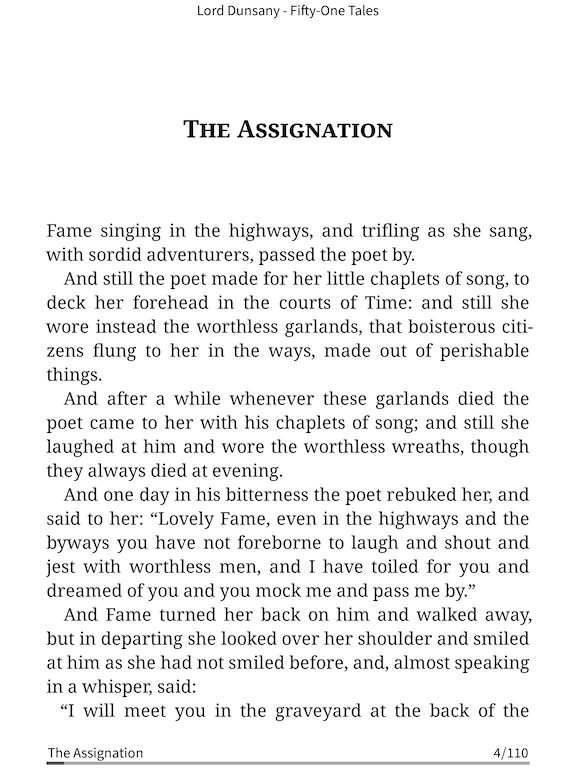
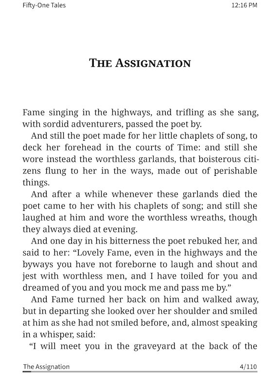
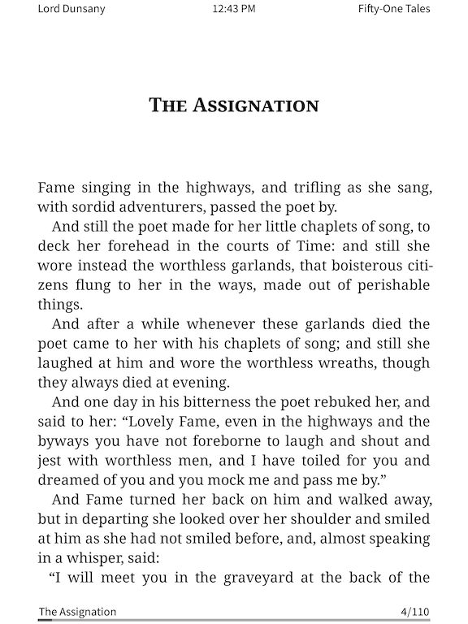

# KOReader.patches

This is where I put assorted user patches I have made for KOReader. 

Support here is much more limited compared to Project: Title, but feel free to open an issue if you encounter a bug. 
But to keep expectations in check: I may not fix it, if it doesn't impact how I use the patch.

Please do not submit any feature requests. I made these to do what I wanted them to, sometimes adding in a little 
extra when it's not too much work or I found it interesting. Rather, feel free to expand on them however you like, 
and remember to share with me any neat stuff you add.

Links below with brief descriptions. Longer descriptions and instructions can (sometimes) be found at the top of the
user patch file itself.

### [🞂 2-disable-all-progressbars.lua](2-disable-all-progressbars.lua)
[Project: Title](https://github.com/joshuacant/ProjectTitle) only. Hides all information overlays on books in Cover Grid.

### [🞂 2-disable-fullyread-progressbars.lua](2-disable-fullyread-progressbars.lua)
[Project: Title](https://github.com/joshuacant/ProjectTitle) only. Hides progress bars in Cover Grid when a book is 100% or marked
as finished. Optionally shows the trophy in the corner, like the old Cover Browser dogear style.

### [🞂 2-disable-unread-progressbars.lua](2-disable-unread-progressbars.lua)
[Project: Title](https://github.com/joshuacant/ProjectTitle) only. Hides progress bars in Cover Grid when a book is new/unopened.

### [🞂 2-font-override.lua](2-font-override.lua)
[Project: Title](https://github.com/joshuacant/ProjectTitle) only. Uses the plugin's sans-serif font across the entire KOReader UI.

### [🞂 2-menutext-overrides.lua](2-menutext-overrides.lua)
Moves English articles (a, an, the) to the front of file/folder names, and replaces underscores with spaces.

### [🞂 2-reader-footer-font-override.lua](2-reader-footer-font-override.lua)
[Project: Title](https://github.com/joshuacant/ProjectTitle) only. Sets the Status Bar font to the serif font included with the plugin.

### [🞂 2-reader-footer-widgets.lua](2-reader-footer-widgets.lua)
[Project: Title](https://github.com/joshuacant/ProjectTitle) only. Allows for customization of the widgets (time, wifi, battery, frontlight) shown in the footer of Project: Title.

### [🞂 2-reader-header-centered.lua](2-reader-header-centered.lua)
Adds a header, like the "Status Bar" footer, but at the top center of the screen.

### [🞂 2-reader-header-cornered.lua](2-reader-header-cornered.lua)
Adds header, like the "Status Bar" footer, but at the top left/right corners of the screen.

### 🞂 2-reader-header-centered.lua AND 2-reader-header-cornered.lua
You can combine both at the same time, as long as you're careful in picking what to display and your max width settings.

### [🞂 2-reader-header-print-edition.lua](2-reader-header-print-edition.lua)
Emulates the look of a physical book, with the page numbers alternating between upper left and upper right corners,
the text at the center of the top alternating between "author - title" and "chapter name", and the page number is
shown centered at the bottom for the first page of a chapter.

### [🞂 2-toolbar-add-buttons.lua](2-toolbar-add-buttons.lua)
[Project: Title](https://github.com/joshuacant/ProjectTitle) only. Requires Project: Title version 3.5 or higher. Adds 2 or 4
buttons to the title bar.

### [🞂 2-toolbar-replace-button.lua](2-toolbar-replace-button.lua)
[Project: Title](https://github.com/joshuacant/ProjectTitle) only.  Requires Project: Title version 3.5 or higher. Replaces
a button in the title bar with a new icon and tap/long-press actions.
